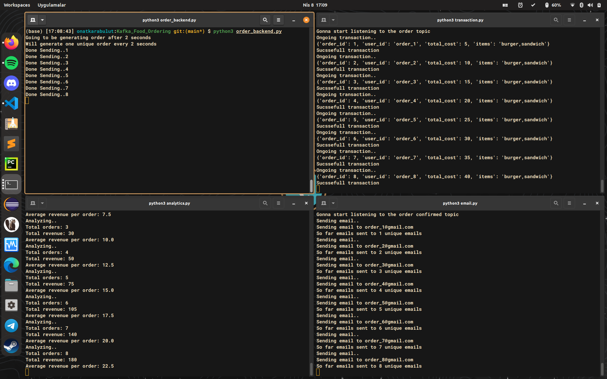

# Kafka_Food_Ordering_Clone_Demo
This is a clone project. For those using Docker, docker_compose.yml is included. 

Start Kafka from the local machine (for those not using Docker):

- $ sudo systemctl start zookeeper
- $ sudo systemctl start kafka

